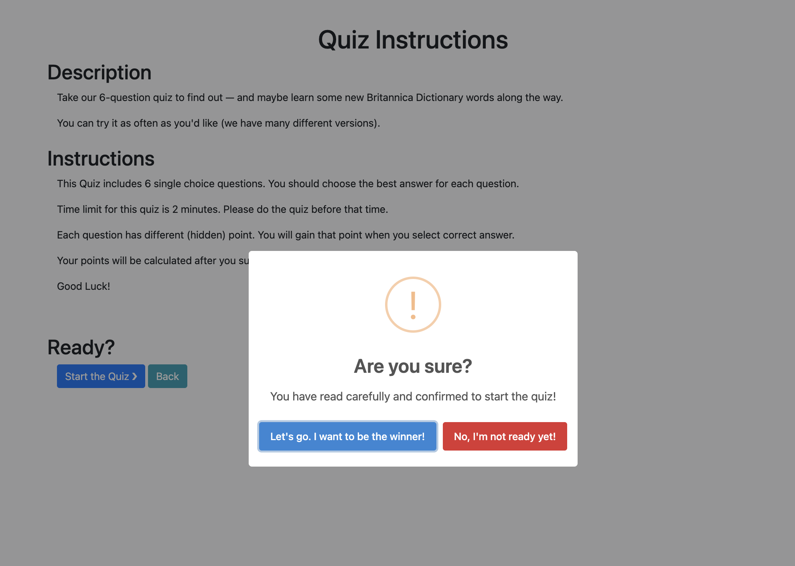

# English Quiz Submission

Hi there, it's Tino.

This is my submission for English Quiz.

## Introduction
There is a platform named English Learning, where provides materials for learners to study English: classes, sessions, exams,....

Now we are developing a new feature to help learners have a chance to practice or compete.

We call it "Quiz-System".
In the first phase of this project, we will focus on creating an MVP: vocabulary quiz.

## Requirements

System has many quiz challenge, which users can join and compete with the others.
There are 2 ways to join a challenge:
1. Accessing by code
2. Accessing list quizzes ==> Go to detail ==> Click button Join

Also, there is a Top Rank section, to show the top 100 users in that quiz, based on the score they gained.
This board is updated constantly every time there is a new submission.

## Assumption
- Quiz will have n questions, each question has different point
- Quiz can be opened for anonymous or require logging in (based on setting)
- Quiz can be start at a specific time or anytime
- Each quiz has a time frame to finish
- The order of questions for each user might be randomized
- Each quiz has limit time to complete
- A question can be single choice or multiple choice question
- Quiz will have specific end time. At this time, the leader board will be finalized.
- Users have same score will be in the same rank

## Solution
### Architecture
#### Architecture diagram

#### Components explanation:
- DNS: first step to filter requests, prevent spaming, xss, DDoS... Consider vendors: AWS Route53 + AWS WAF + AWS Shield; CloudFlare
- CDN: to cache statics content or to host a static web or SPA. AWS Cloudfront or CloudFlare Pages
- Load Balancing: to distribute network traffic to improve application scalability AWS ALB
- API gateway: to authenticate, authorization requests.
- Services: where requests are mainly handled
- Cache: to cache-retrieve data faster
- Queue: queue handlers for services, internal communication mean.
- Database: where store the data
- Notification/socket: external communication with outside (realtime)
- Log service: external service to monitor the logs from server

#### Technologies & Tools:
**Technologies**
- DNS: [CloudFlare](https://www.cloudflare.com/)
- CDN: [CloudFlare](https://www.cloudflare.com/)
==> Saving cost
- Load Balancing: Either [AWS ALB](https://aws.amazon.com/elasticloadbalancing/application-load-balancer/) or CloudFlare
- API gateway: self-implement to customize better.
- API Gateway & Services: hosted on [AWS EC2](https://aws.amazon.com/ec2) (Or [AWS ECS](https://aws.amazon.com/ecs) & [AWS EKS](https://aws.amazon.com/eks) long-term) - NodeJs, Go, or PHP
- Database: [AWS RDS - PostgreSQL](https://aws.amazon.com/rds)
- Queue: [AWS SQS](https://aws.amazon.com/sqs)
- Cache: [AWS Elastic Cache - Redis](https://aws.amazon.com/elasticache)
- Notification: [Firebase FCM](https://firebase.google.com/docs/cloud-messaging) - Or [AWS SNS](https://aws.amazon.com/sns/)
- API doc: [OpenAPI - Swagger](https://swagger.io/specification/)
- Security: meets The OWASP Top 10

**Tools:**
- [Sentry](https://sentry.io/) - Monitor log
- [AWS CloudWatch](https://aws.amazon.com/cloudwatch/) - monitor services, rds

#### Typical request lifecycle:
1. Request from end users (call directly by API (mobile) or call API from browser) will be sent to DNS by domain, where the check for security happens.
2. If the request is safe, then goes to the ALB. At here, based on the concurrent user amount, the request is sent to corresponding API gateway instance.
3. API Gateway will authenticate and authorize the request, then proxy to the services.
4. If a retrieval request, services will prioritize to retrieve from the Cache, if does not exist, calls to the database (and then cache to Cache layer for next request)
5. If a post/put/delete, just store to the database directly and update the cache (if needed).
6. If service needs another data source from another service, it will call to internal service and retrieve data.
7. After a post/put/delete request, if need to send notification to other services, we use Queue; or use Notification service if need to notify end-users

### Data Flow
#### Admin side
Admin will create and manage quiz categories, quizzes, and questions.
- Create quiz category
- Create Quiz and Questions for quiz

#### Client side

- List of quizzes: Client accesses List Quizzes page, where displays the all active Quizzes
- Quiz's Detail
    + Client clicks on item to view quiz detail
    + Client also can visit this page by input the code (quiz.code)
    + At there, a list of TOP RANKS will be shown. This is the list of first 100 submissions (ordered by total points ascendingly)
    + This board will be updated constantly by listening to a stream of data
- Quiz pre-start:
    + By clicking on button Start Quiz (on Quiz's detail page), user will be navigated to this page.
    + Quiz's title, description, and instruction will be shown.
- Quiz started:
    + Clicking on "Start" button on  Quiz pre-start page, the quiz will be started.
    + User answers the questions, and then inputs name/email at the last step, then submit to the server
    + Server will validate the data, then compares with the correct answers, calculate the points, and then update the TOP RANKS statistics by pushing a notification.
    + User then will be redirected to the Quiz's detail page, the TOP RANKS board will be updated automatically.

### Database

**QuizCategories**
This table is to store the categories. For example: animal, cosmos, plane,....

|Column|Type|Description|
|-|-|-|
|id|big integer|Primary key|
|slug|string|Unique slug|
|description|text||
|image|string|Link to banner|
|parent_id|big integer|Determine if this has parent category or not|
|number_of_quizzes|integer|Count how many quizzes in this category|
|order|integer|To order the categories on menu|

**Quizzes**
To store the quizzes

|Column|Type|Description|
|-|-|-|
|id|big integer|Primary key|
|code|string|Unique code|
|quiz_category_id|big integer|Category id|
|title|string||
|description|text||
|instruction|text||
|start_time|datetime||
|end_time|datetime||
|duration_in_minutes|integer||
|number_of_questions|integer||
|maximum_point|integer||
|is_anonymous|boolean|Allow joining without logging in|
|is_randomize_question|boolean||
|status|string|`draft`,`scheduled`,`on-going`,`ended`,`finished`|
|number_of_submissions|integer|Count submissions|
|lowest_point|integer|The lowest point of submissions|
|highest_point|integer|The highest point of submissions|

**QuizQuestions**
To store the questions

|Column|Type|Description|
|-|-|-|
|id|big integer|Primary key|
|quiz_id|big integer||
|point|integer||
|question|string||
|type|string|`single_choice`,`multiple_choice`,`text`|
|options|text|JSON of choices|
|answer|string|Stores the correct answer.  For example: 'A' (single), ['A', 'B'] for multiple choice|

**QuizSubmission**
To store the quiz submission.

|Column|Type|Description|
|-|-|-|
|id|big integer|Primary key|
|quiz_id|big integer||
|submission_code|string|unique code for this submission|
|user_id|big integer||
|user_name|string||
|user_email|string||
|started_at|datetime||
|submitted_at|datetime||
|number_of_corrections|integer||
|total_points|integer||
|detail|text||
|rank|integer||

Below graph demonstrates the tables' relationships.

## Implementation
### BE side:
Provide APIs:
- Listing Quizzes
- Get Quiz by Code
- Start the Quiz
- Submit Quiz

Add API doc for the APIS. See at [this link](./api-document/client/quiz.html) or [this Postman collection](./api-document/client/English%20Learning.postman_collection.json), or can see how it looks like:

To ensure the quality for code, I suggest follow the [Pyramid Testing Strategy](https://www.leapwork.com/blog/testing-pyramid)
- Unit test
- Feature test
- API test

And if we do have UI, can use E2E test.

In this project, I already do sample Unit test and Feature Test for function `QuizService@submitQuiz`, where:
- Unit test cover 100% code
- Feature test (sample for the method)

Screenshot: 

### FE Side
Provide simple UI:
- List quizzes
- Quiz detail
- Do the quiz

### Example flow
Example request to get list of Quizzes

Example request to get list of submitting quiz

## Demo
Some screenshots:

|Name|Image|
|-|-|
|List quizzes||
|Go to Quiz detail by clicking Detail button||
|Input Quiz Code||
|Another quiz detail (accessing by quick code)||
|After clicking Join in Detail page||
|Confirm before starting||
|Answer the questions||
|Submit the quiz||

Video

## Additional Notes
### Achievement
- In this project until this time, I already provided a simple flow a quiz workflow, including realtime updating leader board.
- The Architecture for larger scope was designed.
- The tools & technologies were defined
- Applied technique into the code: TDD, SOLID principle, Singleton, Dependencies Injection

### Future works
Consider below points:
- Store the duration of submission
    + Display this time in leader board
    + If users finished the quiz with same point, the soonest the higher rank
- When the Quiz finish, re-calculate the rank, and update to quiz submission
- Develop more type of quiz
- Update level for quiz, multiple category for quiz
- Logged in users can see their previous results
- Add module api-gateway, and quiz-module will be opened only requests come from api-gateway and internal services
- We can also "plug" this module to other services.

### Uncompleted works
- In this phase, I have not implemented the timer.
    + Each quiz has a limit timeframe to finish
    + In the UI, need to count the time
    + From BE, need to validate
- Quiz has status, but in this demo, I just list all quiz.
    + Need to allow more filter
    + Need to get only non-draft quizzes
- Some submissions can be created but have not submitted yet
- After the quiz ends, we need to update the ranks for all submissions.
- Set up docker
- In this phase, we only can get realtime if we do register subscribing topic from FE, which has not completed yet. In my local, I force subscribe the topic by calling `RealtimeNotification@subscribeToTopic` function with my local token.

## Conclusion
In this submission, I already designed a general system for English Learning and create a demo for a small feature in that system, called Quiz Challenge.

As designed in microservices system, this can be expanded and extended easily.

For those who want to setup project locally, please reach out to [this document](./application/quiz/src/README.md) for setting up BE.

For UI, can run directly `fe/index.html` file.

For more detail or discussion, please feel free to reach out to me via email quachtinh761@gmail.com

Thank you and hope to see you soon.

Tino Nguyen

## Work log

|Date|Spent Hours|Description|
|-|-|-|
|2024-09-19|6|- Init template - Analyze requirement - Create Infrastructure|
|2024-09-20|6|Design Database; Init code|
|2024-09-21|8|Implementation|
|2024-09-22|12|Implementation & Write documentation|
|2024-09-23|4|Write documentation & Record Video|
|**Total**|**36 hours**|-|
