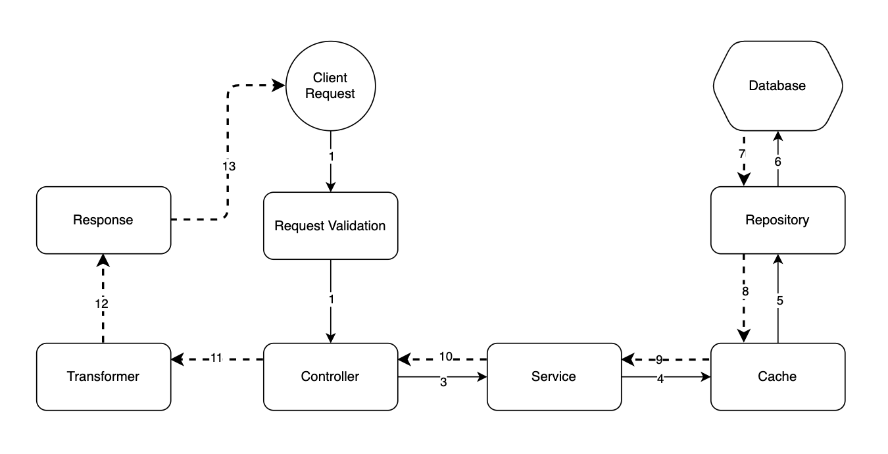

# Module Quiz

## Description
This is module of quiz, where provide challenges for users.

## Technical requirement

This project is written by Laravel 10 (API) and HTML, JQuery (UI).

Until we can setup by docker, please help set up your end. Requirement:
- PHP >= 8.1
- PostgreSQL (or MySQL - does not matter)
- Firebase setup with credential file (follow [this document](https://firebase.google.com/docs/cloud-messaging/js/client))

## Source structure
```
ROOT
|  README.md *This file*
|  app
|  |  ...
|  |  Enums *Folder to contains enum files*
|  |  |  SomeEnum.php *Sample file*
|  |  Events
|  |  |  QuizSubmittedEvent.php
|  |  Http
|  |  |  Controllers
|  |  |  Repositories
|  |  |  Requests
|  |  |  Responses
|  |  |  Services
|  |  |  Transformers
|  |  Jobs
|  |  Listeners
|  |  Models
|  credentials
|  |  firebase_credentials.example.json
|  .env.example
```

## Setup project
- Create `.env` file, place same location with `.env.example`. Can duplicate `.env.example` and reuse it's content. Then change the config for queue, database connection.
- In the root of project, run command:
    ```
    composer install
    ```
- Then run following commands consequently:
    ```
    php artisan key:generate
    php artisan migrate
    php artisan db:seed
    ```
- Create `firebase_credentials.json` next to `firebase_credentials.example.json` and use your credential. Without this, you will not able to push notification to firebase.
- Run this command to run the project:
    ```
    php artisan serve
    ```
    The project then run at `locahost:8000`

## Request Workflow

This project is created based on "Repository Patter". Please refer to below image for further detail:

